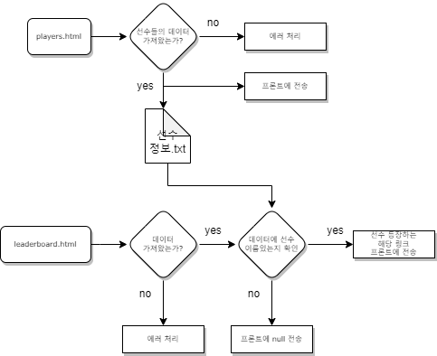
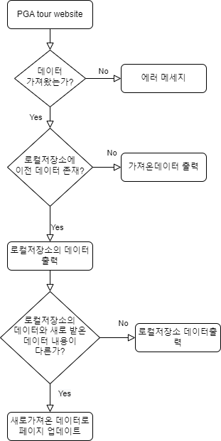

# toy_1

# 1. 프로젝트 소개 및 동기
- ### 올해 미국 PGA골프 투어에서 활동중인 선수들을 모아 보여줍니다. 
# 2. 기술 스택
- ### Frontend
  - React, Redux, Redux toolkit, Axios, React-bootstrap
- ### Backend
  - NodeJS, Express, Cheerio, Puppeteer 
# 3. 페이지구성
- Home : 올해 활동중인 한국선수들의 사진과 이름을 보여줍니다.
- Players : 한선수를 선택하면 선수에 대한 정보가있는 링크를 보여줍니다.
- Leaderboard : 이번주 경기의 시합정보와 리더보드를 보여줍니다.
# 4. Flowchart
<table>
  <thead>
    <tr>
      <th>
        설명
      </th>
      <th>
        플로우 차트
      </th>
    </tr>
  </thead>
  <tbody>
    <tr>
      <td>
        <h5>리더보드 페이지의 하이라이트 영상들중에   한국인이 나온다면 해당 영상링크를 프론트로 전송</h5>
      </td>
      <td>
        
      </td>
    </tr>
    <tr>
      <td>
        <h5>페이지 방문때마다 scraping 작업으로인한 긴 로딩시간.   웹페이지에서 scraping 하는동안    로컬저장소 활용하여 이전기록 보여주기</h5>
      </td>
      <td>
        
      </td>
    </tr>
  </tbody>
</table>

